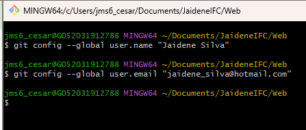
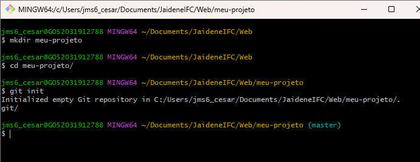
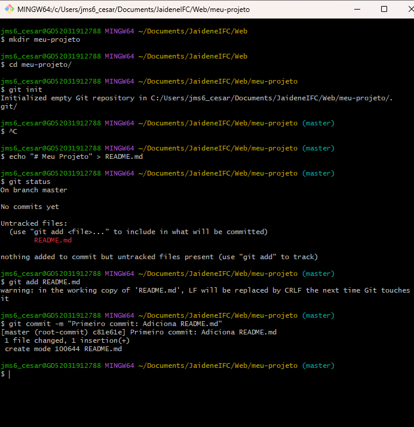
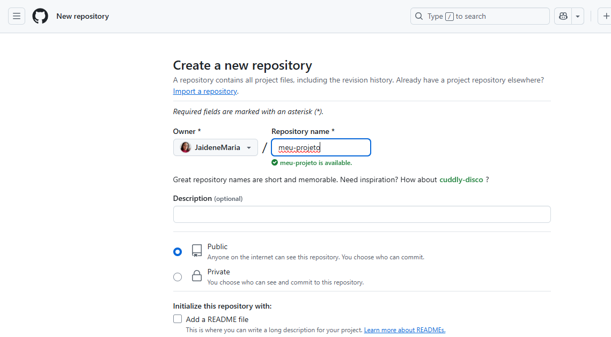
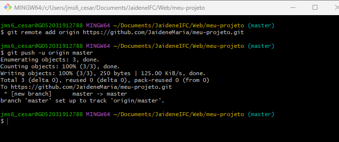
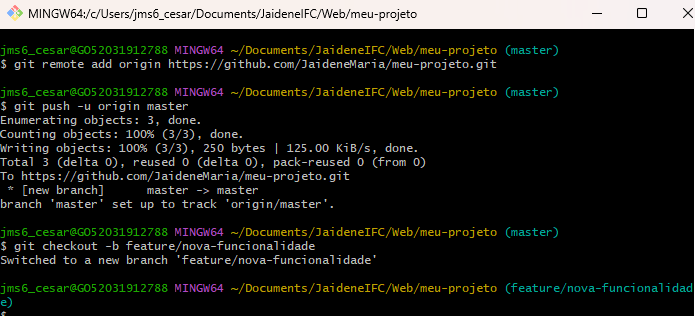
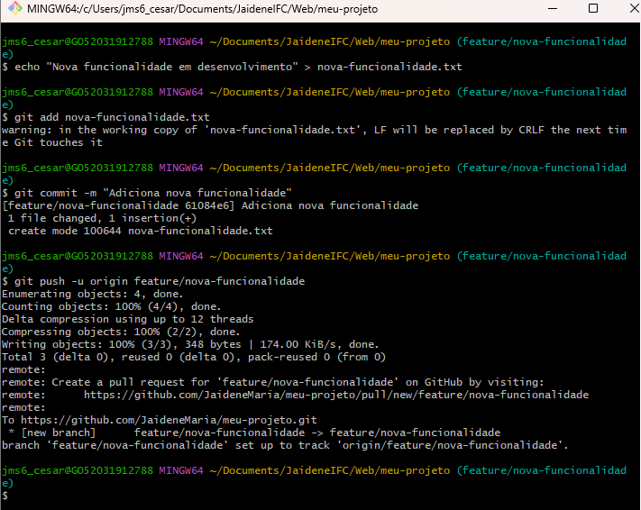
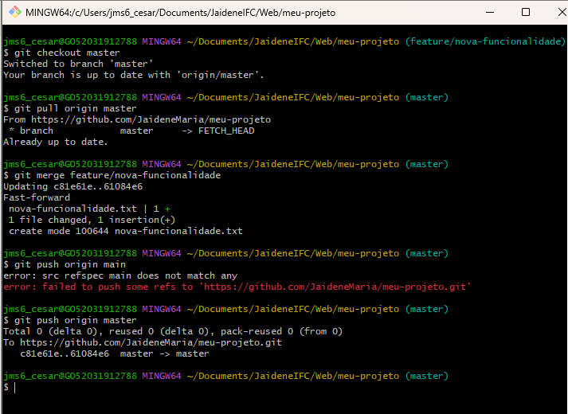

## Laboratório Prático - Unidade 2 - Git e GitHub

###  1. Configuração Inicial do Git

---

### 2. Criação do repositório local

---

### 3. Adicionando arquivos e realizando o commit

---

### 4.  Criando um Repositório no GitHub

---

### 5.  Conectar o Repositório Local ao GitHub

---
### 6.  Criar e Trabalhar em uma Nova Branch

---

---

### 7.  Fazer Merge da Branch na Main

---

